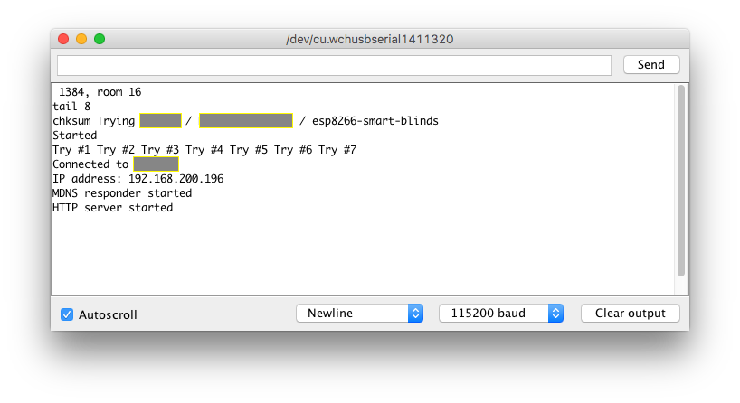

# NodeMCU-ESP8266-Servo-Smart-Blinds
DIY Smart Blinds using NodeMCU V3/ESP8266 and an MG995 Servo. Integration with SmartThings.

## Parts

 - [NodeMCU V3 / ESP-12E Development Board](https://www.aliexpress.com/item/ESP8266-CH340G-CH340-G-NodeMcu-V3-Lua-Wireless-WIFI-Module-Connector-Development-Board-Based-ESP-12E/32800966224.html) - $2.75
 - [MG995 Servo](https://www.aliexpress.com/item/Free-shipping-1pcs-lot-MG995-55g-servos-Digital-Metal-Gear-rc-car-robot-Servo-MG945-MG946R/32270781027.html) - $3.08
 - Micro USB Cable

## Modding the Servo for Continuous Rotation

The MG995 Servo can only rotate 180°. This [video](https://youtu.be/8bcYB-0bctE?t=1m14s) is a guide to mod the servo for continuous 360° rotation. At [1m 59s](https://youtu.be/8bcYB-0bctE?t=1m59s), he used a pair of needle nose pliers to remove the stop pin from the gear, but that did not work for me. I had to use a dremel to cut it off.

**NOTE: I HAVE IMPLEMENTED ZERO SECURITY IN THIS CODE. USE AT YOUR OWN RISK**

## Setting up NodeMCU with Arduino IDE

I used this [video](https://www.youtube.com/watch?v=NEo1WsT5T7s) to get started uploading code to the NodeMCU. I'm using a mac so I used these [drivers](https://github.com/MPParsley/ch340g-ch34g-ch34x-mac-os-x-driver).

## Uploading code to the NodeMCU

 1. Clone this repo somewhere on your computer
 2. Change the default wifi variables in the `smart-blinds.ino` sketch
	 ```
	#define DEFAULT_WIFI_SSID "My Wifi Nework 5G"
	#define DEFAULT_WIFI_PASSWORD "MyWifiP@assword"
	#define DEFAULT_HOSTNAME "esp8266-smart-blinds"
	```
3. Connect the NodeMCU and upload the sketch
4. If you go to `Tools` > `Serial Monitor`, You will see something like this:
	
	
5. From here you can access the website via `http://esp8266-smart-blinds.local/version` (or whatever you set your `DEFAULT_HOSTNAME` to be) or `http://IPHERE/version`
6. Now you need to clear your EEPROM by going to `http://esp8266-smart-blinds.local/clear`

## Connecting the Servo to the NodeMCU

For some reason, every time I flash the code while the servo is connected, it won't work. So many sure you disconnect when you upload your code using USB.

1. Servo Pins: Orange is PWM / Red is 3.3v VCC / Brown is Ground
2. Connect the Servo connector so that the orange pin is at `D4`, red on `3V` and brown on `G`. No jumper cables needed
3. Now go to `http://esp8266-smart-blinds.local/close` and `http://esp8266-smart-blinds.local/open` to watch the servo spin in two different directions
4. To view the speed / duration configuration: `http://esp8266-smart-blinds.local/config`
5. To change the speed / duration configuration: `http://esp8266-smart-blinds.local/config?speed=2&duration=5000`, then go back to `/open` or `/close` to see the changes
6. To view the wifi configuration: `http://esp8266-smart-blinds.local/wifi`
7. To change the wifi configuration: `http://esp8266-smart-blinds.local/wifi?ssid=NEW+Wifi&password=blah`. After this, the NodeMCU will reboot and try to connect to the new network. If it can't connect to the new network within 60 seconds, it'll revert back to the defaults defined in the sketch.

## 3D Printing the Ball Chain Adapter

My blinds run on a ball chain, so I 3D printed this [adapter](https://www.thingiverse.com/thing:2850794) to attach to the servo motor arm.
